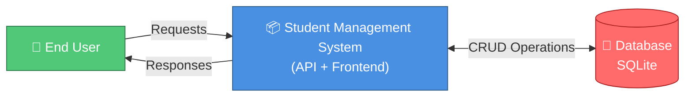
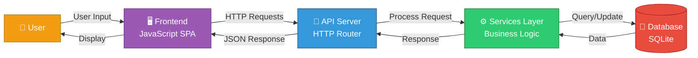
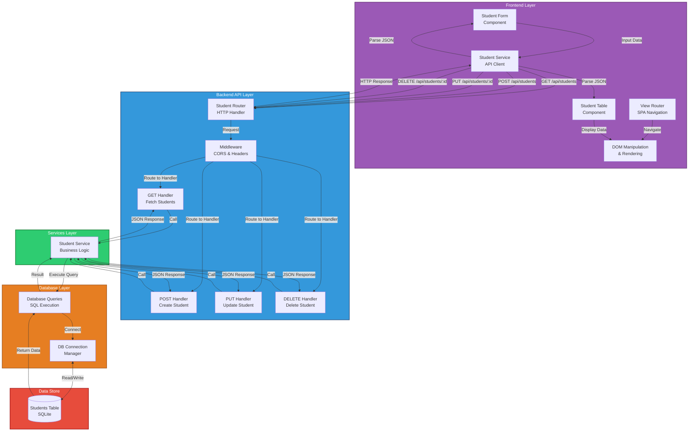

# Student Management System

A full-stack student management application built with Python backend and vanilla JavaScript frontend for managing student records.

## 🏗️ Architecture Overview

The system follows a layered architecture with clear separation of concerns:
- **Frontend**: Single Page Application (SPA) in vanilla JavaScript
- **Backend**: Python HTTP Server with RESTful API
- **Database**: SQLite database for persistent storage
- **Core**: Middleware, routing, and utility modules

---

## 📊 Data Flow Diagrams

### Level 0 DFD (System Context Diagram)

```
User → [Student Management System] ↔ Database
```

**Description**: High-level view showing the system as a single entity interacting with users and a database.



---

### Level 1 DFD (High-Level Process Decomposition)

```
User → Frontend → API Server → Services → Database
         (UI)      (Router)    (Business)  (Storage)
```

**Description**: System broken down into main processes and data stores.



---

### Level 2 DFD (Detailed Process Decomposition)

**Description**: Detailed breakdown showing individual processes, data flows, and components.



---

## 📁 Project Structure

```
.
├── app.py                      # Server entry point
├── router.py                   # HTTP routing logic
├── requirements.txt            # Python dependencies
├── controllers/
│   └── students.py            # HTTP request handlers
├── services/
│   └── student_service.py      # Business logic
├── database/
│   ├── connection.py           # Database connection
│   └── queries.py              # SQL queries
├── core/
│   ├── middleware.py           # CORS & request processing
│   ├── request.py              # Request parsing
│   ├── responses.py            # Response formatting
│   └── static.py               # Static file serving
└── frontend/
    ├── pages/                  # HTML pages
    └── assets/
        ├── css/                # Stylesheets
        └── js/                 # JavaScript modules
            ├── app.js          # Main app entry
            ├── components/     # UI components
            ├── controllers/    # Frontend logic
            ├── services/       # API communication
            ├── router/         # View routing
            ├── state/          # State management
            └── utils/          # Helper functions
```

---

## 🚀 Data Flow Summary

### Complete Request-Response Cycle:

1. **User Input**: User interacts with UI in the browser
2. **Component Processing**: JavaScript components handle user input
3. **API Request**: Student Service makes HTTP request to backend
4. **Route Matching**: Router directs request to appropriate handler
5. **Middleware Processing**: CORS and header middleware processes request
6. **Business Logic**: Student Service processes the request
7. **Database Query**: Database layer executes SQL queries
8. **Data Retrieval**: SQLite returns requested data
9. **Response Building**: Service builds JSON response
10. **HTTP Response**: API returns response to frontend
11. **UI Update**: Frontend updates DOM and displays data to user

---

## 🔧 Technology Stack

- **Backend**: Python, HTTPServer
- **Frontend**: Vanilla JavaScript (No frameworks)
- **Database**: SQLite
- **Architecture**: Layered/N-tier architecture